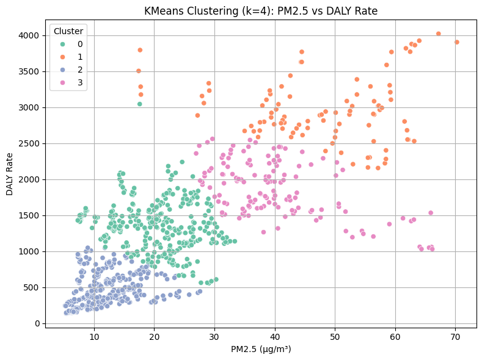

# 🌍 Air Pollution & Health: Exploratory Data Analysis, Hypothesis Testing and Machine Learning

## 📌 Introduction

Air pollution is a major global public health concern, linked to respiratory illnesses, cardiovascular diseases, and overall health burden.  
Fine particulate matter (**PM2.5**) in particular has been widely studied for its detrimental effects on human health.

In this project, we explore the relationship between **PM2.5 air pollution levels** and **health outcomes** across multiple countries from **2015 to 2019**.

### 🔍 Our analysis includes:
- Cleaning and merging environmental and health datasets
- Conducting **Exploratory Data Analysis (EDA)** to visualize trends
- Formulating and testing **statistical hypotheses** to assess the strength and nature of the relationships
- Applying **machine learning models** (e.g., KNN, logistic regression, K-means clustering) to make predictions and uncover structure in the data

### 🩺 Health indicators investigated:
- **Disability-Adjusted Life Years (DALY) rates**
- **Death rates attributable to air pollution-linked diseases**
- **Proportional burden of pollution-linked deaths** relative to all-cause mortality

By combining descriptive visualizations, statistical testing, and machine learning techniques, this study aims to better understand whether worsening air quality correlates with deteriorating health conditions globally — and to what extent these impacts can be detected within a five-year timeframe.

**Interpretation:**

 This scatterplot shows a moderate upward trend, suggesting that as PM2.5 levels rise, the overall DALY(Disease Adjusted Life Years) rate across all diseases tends to increase. The spread is wide, so while there is some association, it may not be disease-specific.

 This correlation matrix shows a **strong positive relationship** between air pollution (PM2.5) and both health indicators:
 - **PM2.5 vs DALY Rate**: r = 0.74  
 - **PM2.5 vs Death Rate**: r = 0.77

This suggests that as air pollution increases, so do both the **overall disease burden (DALY)** and **mortality rates**, across all diseases combined. The **extremely high correlation** between DALY and Death Rate (r = 0.96) also confirms they track closely together, reflecting consistent patterns in the health impact of pollution.

### **Interpretation: Disease-Specific Impact of Air Pollution**

The diseases analyzed in the above plots were **specifically selected by the World Health Organization (WHO)** due to their established or suspected links to **air pollution**. These are not random illnesses — they represent health outcomes that have consistently appeared in global burden of disease assessments as **pollution-sensitive conditions**.

As expected, **respiratory diseases** — such as **acute lower respiratory infections** and **chronic obstructive pulmonary disease (COPD)** — show clear positive correlations with PM2.5 levels. This aligns with existing literature that directly associates airborne pollutants with damage to the respiratory tract.

What’s particularly notable is that **non-respiratory diseases**, especially **ischemic heart disease** and **stroke**, also show **strong correlations** with air pollution. These findings reinforce the emerging understanding that pollution is not only a respiratory hazard, but a **major cardiovascular risk factor**. Fine particulate matter can enter the bloodstream, promote inflammation, and contribute to plaque buildup in arteries, thereby increasing the risk of heart attacks and strokes.

In contrast, **lung cancer** shows a **weaker correlation** in this dataset. However, this does not necessarily indicate a lack of association. Cancer, particularly lung cancer, often involves a **long latency period** — meaning that the effects of pollution exposure today may not be reflected in cancer rates for many years. Additionally, lung cancer is influenced by **multiple risk factors**, such as tobacco use and occupational exposure, which may dilute the immediate visibility of pollution’s effect in global, cross-sectional data.

 **Interpretation:**

From 2015 to 2019, global average PM2.5 levels show a slight downward trend, likely reflecting the effects of environmental regulations, technological improvements, and increasing global focus on air quality management.

During the same period, both the total DALY rate and total death rate across all diseases show a modest decrease. The decline in DALY rates suggests improvements in overall health outcomes and quality of life — people may be living longer with fewer years lost to illness or disability.

However, the decrease in the total death rate appears smaller and more gradual, indicating that while quality of life and disease burden are improving, mortality itself remains relatively stable over short timescales like five years.

It’s important to recognize that these trends could be influenced by multiple overlapping factors — including healthcare access, vaccination programs, public health initiatives, and demographic shifts — in addition to air pollution control. Therefore, while the timing aligns with reductions in PM2.5, it is difficult to attribute the observed improvements solely to air pollution changes without deeper causal analysis.

### **Interpretation: Correlation Between Air Pollution and Pollution-Linked Disease Burden**

This heatmap displays the correlation between **PM2.5 levels** (fine particulate matter in the air) and the **proportional burden of pollution-linked diseases** across countries.

- **PM2.5 (Air Pollution)**: Measured in μg/m³, represents ambient air pollution levels.
- **Pollution-Linked Disease Burden**: Computed as the ratio of deaths from diseases WHO has associated with air pollution (e.g., respiratory, cardiovascular) to total all-cause death rates per 100,000 population.

#### **Key Result: r = 0.68**
- This means there is a **strong positive correlation** between air pollution and the proportion of deaths caused by pollution-linked diseases.
- In other words, in countries with **higher PM2.5 levels**, a **greater share of deaths** is attributed to diseases that are known to be impacted by air pollution.
- The correlation coefficient (r) ranges from -1 to +1:
  - **r = 0.68** suggests a meaningful upward trend, not random, and not weak.
  - It’s not perfect, but **strong enough** to indicate a pattern that likely reflects a **real-world causal link** (especially since these are WHO-selected diseases).

#### **Implications:**
- This supports the idea that **air pollution is not just an environmental issue**, but a major contributor to **health disparities** and **mortality structure** across countries.
- It also validates using the pollution-linked death subset as a meaningful health indicator when tracking environmental risk.

# Hypothesis Testing
### 1st Hypothesis Formulation
#### Is there a monotonic relationship between PM2.5 concentration and the total DALY rate per 100,000 population?

**Null Hypothesis (H₀):**  
There is no significant difference in DALY (Disability-Adjusted Life Year) rates between countries with high and low PM2.5 air pollution levels.

**Alternative Hypothesis (H₁):**  
Countries with higher PM2.5 air pollution levels have significantly higher DALY rates compared to countries with lower PM2.5 levels.

Countries are divided into high and low air pollution groups based on the median PM2.5 level. Then, their DALY rates are visualized using histograms and KDEs. The high pollution group showed a noticeably higher distribution of DALY rates, suggesting that countries with worse air pollution tend to face greater overall health burdens. This aligns with our hypothesis that pollution increases disease impact. Also by looking at the KDE lines it can be concluded that normal distribution cannot be assumed.

#### Mann-Whitney U Test: PM2.5 vs Total DALY Rate

This non-parametric test compares DALY rates between countries with high and low air pollution.  
It tests whether countries with **higher PM2.5** levels tend to have **significantly higher DALY rates**.

The Mann-Whitney U test was used to compare total DALY rates between countries with high and low levels of PM2.5 air pollution. Since the data did not meet the assumptions of normality, a non-parametric test was selected to ensure statistical validity.

#### Results:

The resulting **U statistic = 177114.00** and **p-value < 0.0001** indicate a statistically significant difference between the two groups. Specifically, countries with higher air pollution levels tend to exhibit **significantly higher total disease burdens**, as measured by DALY rates.

The **U statistic** itself reflects the number of times a value from one group is ranked higher than a value from the other group. A higher U statistic (in the "greater" direction) supports the hypothesis that values in the high-PM2.5 group tend to be greater than those in the low-PM2.5 group.

These results reinforce the finding that **air pollution is strongly associated with increased public health burdens at a population level**.

**Conclusion:**  
The visualization clearly shows that DALY rates are generally higher in countries with elevated PM2.5 levels. Combined with the statistically significant result from the Mann-Whitney U test (p < 0.05), we reject the null hypothesis (H₀). This supports the conclusion that higher air pollution is associated with greater total disease burden across countries.

### 2nd Hypothesis Formulation:
#### Is there a monotonic relationship between PM2.5 concentration and the absolute age-standardized death rate caused by pollution-linked diseases (per 100,000 population)?

- **Null Hypothesis (H₀):** There is no monotonic association between PM2.5 levels and age-standardized death rates attributable to pollution-related illnesses.
- **Alternative Hypothesis (H₁):** There is a positive monotonic association — higher PM2.5 levels are associated with higher age-standardized death rates from diseases linked to air pollution.

To evaluate the relationship between air pollution and total mortality, a Spearman rank correlation test was conducted. This non-parametric method is suitable for data that do not follow a normal distribution and captures monotonic trends rather than strictly linear ones.

The scatter plot above shows the relationship between PM2.5 concentrations and total age-standardized death rates attributable to pollution-related illnesses. Each point represents a country-year pair. The Spearman correlation coefficient was calculated as **ρ = 0.781** with a p-value of **0.0000**, indicating a strong and statistically significant positive association.

**Conclusion:**  
Since the p-value is far below the 0.05 threshold, we **reject the null hypothesis (H₀)**.  
There is a statistically significant and strong positive association between air pollution levels and total death rates.

### 3rd Hypothesis Formulation:
#### Is there a monotonic relationship between PM2.5 concentration and the proportion of total deaths attributable to pollution-linked diseases?

- **Null Hypothesis (H₀):** There is no monotonic relationship between PM2.5 air pollution and the proportion of deaths caused by pollution-linked diseases out of total number of deaths.
- **Alternative Hypothesis (H₁):** There is a positive monotonic relationship — as PM2.5 levels increase, the proportion of deaths due to pollution-linked diseases out of total number of deaths also increases.

- **Spearman Correlation Coefficient (ρ):** 0.750
- **p-value:** 0.0000

 The correlation is strong and statistically significant. This indicates that countries with higher PM2.5 levels tend to have a greater share of total deaths attributed to pollution-linked diseases.

 **Conclusion:**

 Since the p-value is far below the 0.05 threshold, we reject the null hypothesis (H₀).
There is evidence of a statistically significant positive monotonic relationship between air pollution and the death burden caused by pollution-linked diseases.

### 4th Hypothesis Formulation
#### Do countries with higher PM2.5 values experienced different levels of improvement in DALY rate over time?

**Null Hypothesis (H₀):** There is no monotonic relationship between average PM2.5 levels and the change in total DALY rates from 2015 to 2019.

**Alternative Hypothesis (H₁):** There is a significant monotonic relationship between average PM2.5 and the change in DALY rates.  

Spearman’s rank correlation coefficient was computed between average PM2.5 levels (2015–2019) and the change in total DALY rate (2019 minus 2015).

**Result:**
- ρ = –0.4952  
- p = 0.0000

The negative correlation indicates that **countries with higher pollution levels tended to show larger decreases in DALY rates** over the 5-year span.

This does **not** mean that high-pollution is beneficial — instead, it likely reflects that:
- These countries had **very high DALY rates to begin with**, giving them **greater opportunity for reduction**.
- Countries with **already low pollution and DALY rates** remained relatively **stable**, showing less change.

**Conclusion:**

Since p < 0.05, we reject the null hypothesis. There is statistically significant evidence of a **monotonic relationship** between PM2.5 levels and the change in DALY rate. The **negative ρ** suggests that high-pollution countries improved more, likely due to high initial DALY burdens and potential health interventions during the period.

### 5th Hypothesis Formulation
#### Is there a monotonic relationship between long-term average PM2.5 concentration and the change in total age-standardized death rates over time?

- **Null Hypothesis (H₀):** There is no monotonic relationship between PM2.5 air pollution and the change in total death rates between 2015 and 2019.
- **Alternative Hypothesis (H₁):** There is a monotonic relationship — specifically, as PM2.5 levels increase, the change in total death rates also significantly differs (either increasing or decreasing).

The Spearman correlation result indicates that there is essentially **no monotonic relationship** between average PM2.5 levels and the change in death rates from 2015 to 2019. The coefficient is extremely close to zero, and the high p-value confirms that this observation is **not statistically significant**.

This suggests that **air pollution does not appear to be associated with a meaningful shift (increase or decrease) in total death rates over this 5-year period.**

**Conclusion:**

Fail to reject the null hypothesis since p > 0.05  
There is **no significant relationship** between air pollution levels and change in overall death rates between 2015 and 2019.

### 6th Hypothesis Formation
#### Is there a monotonic relationship between PM2.5 concentration and the change in proportional burden of pollution-linked deaths over time (2019–2015)?

- Null Hypothesis (H₀): There is no monotonic relationship between PM2.5 levels and the change in the proportion of pollution-linked deaths.
- Alternative Hypothesis (H₁): There is a negative monotonic relationship—as PM2.5 increases, the burden of pollution-linked deaths has decreased more over time.

This analysis examines the **change in the proportion** of deaths attributed to pollution-linked diseases from 2015 to 2019, and how that change relates to average PM2.5 exposure across countries. The result showed a moderate negative correlation (Spearman ρ = –0.4114, p = 0.0003), indicating that **higher-PM2.5 countries** tended to experience **greater reductions** in the share of deaths caused by pollution-linked illnesses.

This could suggest that in highly polluted countries, **public health interventions, awareness, or broader healthcare improvements** during this period were more impactful in addressing pollution-linked disease burdens. On the other hand, countries with already low pollution may have had **less room for proportional improvement.**

By focusing on **proportions rather than raw death rates** (hypothesis 5 focused on raw death rates), this test controls for overall mortality trends and highlights how the **relative weight of pollution-linked causes shifted over time.**

**Conclusion:**

Since the p-value is below 0.05, the **null hypothesis is rejected**.  
There is a statistically significant **negative monotonic relationship** between PM2.5 levels and the change in proportional pollution-linked death burden from 2015 to 2019.

# Supervised Machine Learning
### 📈 KNN Regression: Predicting Pollution-Linked Death Rates

To estimate how well PM2.5 levels predict **pollution-linked disease death rates**, a **K-Nearest Neighbors (KNN)** regression model was applied. The model used **PM2.5 concentration** as the input feature and was evaluated using three validation methods:

- **Train/Test Split** (80% train, 20% test)
- **K-Fold Cross-Validation** (k = 5, shuffled)
- **Leave-One-Out Cross-Validation (LOOCV)**

Each model's performance is assessed using **R² Score** and **Root Mean Squared Error (RMSE)**, followed by comparative plots.

### 📈 Interpretation of the Results

When predicting pollution-linked death rates using PM2.5:

- **Train/Test Split** gave the best performance (R² = 0.7914, RMSE = 14.32).
- **K-Fold CV (k=5)** and **LOOCV** showed slightly lower R² (0.63–0.66) and higher errors (~17).

So, the model performs best on a random train/test split but still generalizes reasonably well across different splits. The variation shows it's somewhat sensitive to how the data is divided.

### 📈 KNN Regression: Predicting DALY Rates from PM2.5

This section applies KNN regression to predict **DALY Rates** based on **PM2.5 concentrations**. Three different validation methods are used:

- **Train/Test Split** (80/20)
- **K-Fold Cross-Validation** (k=5)
- **Leave-One-Out Cross-Validation**

Each method is evaluated using **R² Score** and **RMSE**, and results are visualized to compare prediction performance.

### 📊 Interpretation: KNN Regression on DALY Rates

The goal here was to predict **DALY Rates** using only **PM2.5 concentration** via KNN regression.

- **Train/Test Split** gave the best result (R² = 0.5662), meaning ~56% of the variance in DALY rates can be explained by pollution alone.
- **K-Fold (R² = 0.5452)** and **LOOCV (R² = 0.5218)** performed slightly worse, but still consistent.

Overall, the model shows **moderate predictive power**, indicating that PM2.5 explains a portion of the DALY rate trend — but not all. Other health system, demographic, or environmental factors likely play a role too.

### 📈 Logistic Regression on Pollution Burden (Proportional Death Rate)

This model classifies countries as having either **high** or **low** proportional burden of pollution-linked deaths based on **PM2.5 levels** and **year**. Performance is evaluated using accuracy and a confusion matrix.

### Logistic Regression: Proportional Burden Classification

We applied logistic regression to classify whether a country's **Proportional Burden of Pollution-Linked Diseases** is **above or below the median**, using PM2.5 and Year as features.

- **Accuracy:** 79.76%
- Confusion matrix shows:
  - 40 true negatives (correctly predicted low burden)
  - 27 true positives (correctly predicted high burden)
  - 11 false negatives (predicted low but actually high)
  - 6 false positives (predicted high but actually low)

 The model performs fairly well, with a decent balance between sensitivity and specificity. PM2.5 appears to be a strong indicator of pollution-linked death burden levels.

# Unsupervised Machine Learning

### 📈 Choosing Optimal k: Elbow Method for KMeans

The Elbow Method helps determine the ideal number of clusters (k) by plotting the **inertia** (sum of squared distances within clusters) against different values of k.

As seen in the plot:

- The inertia decreases sharply up to **k = 3**, then starts to flatten.
- The **"elbow" point** — where adding more clusters yields diminishing returns — appears around **k = 4**.
- Beyond k = 4, the curve flattens, meaning additional clusters don’t improve the model significantly.

👉 **Therefore, k = 4 is chosen** as a balance between minimizing intra-cluster variation and avoiding overfitting.

### 📊 KMeans Clustering (k=4): PM2.5 vs DALY Rate

This plot shows the results of **KMeans clustering** with **k=4**, applied to two variables:

- **X-axis**: PM2.5 concentration (μg/m³)
- **Y-axis**: DALY Rate (Disability-Adjusted Life Years)

Each color represents a different cluster identified by the algorithm.

---

### 🔍 Interpretation:
- **Cluster 2 (blue)**: Low PM2.5 and low DALY rates — possibly cleaner and healthier countries.
- **Cluster 0 (green)**: Moderate PM2.5 and moderate DALY rates — middle range.
- **Cluster 3 (pink)**: Higher PM2.5 but varying DALY rates — could indicate health mitigation factors.
- **Cluster 1 (orange)**: High PM2.5 and high DALY burden — likely high pollution impact zones.

The clusters show a **clear upward trend**, supporting that higher pollution is often associated with greater health burden, but the separation also suggests other hidden factors may influence this relationship (e.g., healthcare quality, policies).

--- 

This confirms PM2.5 is a strong clustering feature for DALY outcomes.

# ✅ Conclusion

This project examined the relationship between **PM2.5 air pollution** and global **health outcomes** using a mix of **Exploratory Data Analysis (EDA)**, **statistical hypothesis testing**, and **machine learning**.

## 🔑 Key Findings

- **Strong correlations** were found between PM2.5 and both **DALY rates** and **pollution-linked death rates**, confirmed by visual and statistical analysis.
- **Cardiovascular diseases**, not just respiratory illnesses, showed significant associations with air pollution exposure.
- Hypothesis testing revealed that **higher pollution is consistently linked to higher health burdens**, although temporal trends varied by country.
- **KNN regression** models showed **moderate predictive power** for health indicators using PM2.5.
- **Logistic regression** effectively classified countries by pollution-related disease burden.
- **KMeans clustering** revealed structured groupings of countries, reflecting both pollution levels and health impacts.

## 📌 Final Insight

Air pollution is not just an environmental issue — it's a **global health crisis**.  
Through data-driven insights, this study highlights the **critical need for pollution reduction efforts** to improve public health.  
Machine learning enhanced the analysis by uncovering patterns, enabling prediction, and supporting policy-relevant conclusions.

